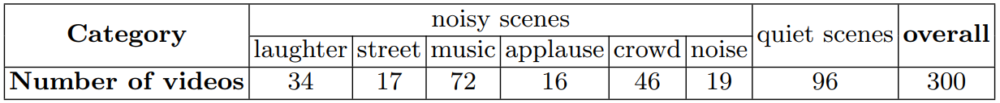

# MVVA-Database
This repository provides the MVVA database in our ECCV paper "[Learning to Predict Salient Faces: A Novel Visual-Audio Saliency Model](https://www.ecva.net/papers/eccv_2020/papers_ECCV/papers/123650409.pdf)".

MVVA is a large-scale eye-tracking database of multiple-face video in visual-audio condition. MVVA contains **Eye Movement** data of **34** subjects on **300** videos, as well as the **soud source annotation** in frame level for all 300 videos. 

## One figure

This database can be used for visual-audio saliency prediction, sound source localization, activate speaker detection, speaker diration, etc. For more details, please refer to [our paper](https://www.ecva.net/papers/eccv_2020/papers_ECCV/papers/123650409.pdf).


<!-- <p align="center"></p> -->

## Download database
MVVA database can be downloaded from [DropBox (Click to view)](https:xxxx) or [百度云](). Please feel free to [contact us by clicking here](mailto:yufan.liu@ia.ac.cn,MinglangQiao@buaa.edu.cn) so that we can give you access to the database. 
Then extract it with:
```
unzip xxx.zip
```

## Data format
xxxs

run the following command to generate saliency maps 
```
python demo.py
```

Usage Example


## Introduction
The multiple-face videos in our MVVA database are at diverse scenarios, and can be categorized into 6 classes,
including TV play/movie, interview, video conference, variety show, music and
group discussion. 
<!--  -->
|  <b>Category  | TV play/movie  | interview | video conference | TV show | music/talk show | group overall | overall |
|  :----:  | :----:  | :----:  | :----: |  :----:  | :----:  |  :----:  | :----:  |
| <b>Number of videos | 53 |  71  | 14 | 67 | 51 | 44 | 300 |


The audio content covers different scenarios including quiet scenes and noisy scenes, as reported in the following table. In the noisy scenes, the
background sounds contain laughter, street, music, applause, crowd and noise.
<!--  -->
|  <b>Category  | laughter  | street | music | applause | crowd | noise | quiet scenes | overall |
|  :----:  | :----:  | :----:  | :----: |  :----:  | :----:  |  :----:  | :----:  | :----:  |
| <b>Number of videos | 34 |  17  | 72 | 16 | 46 | 19 | 96 | 300 |

if you find this database useful for your research, please cite:
```
@article{liu2020visualaudio,
  title={Learning to Predict Salient Faces: A Novel Audio-Visual Saliency Model},
  author={Yufan Liu; Minglang Qiao; Mai Xu; Bing Li; Weiming Hu; Ali Borji},
  booktitle=={Proceedings of the european conference on computer vision (eccv)},
  year={2020}
}
```

## Contact
If you have any question, please contact minglangqiao@buaa.edu.cn (or yufan.liu@ia.ac.cn), or use public issues section of this repository.
