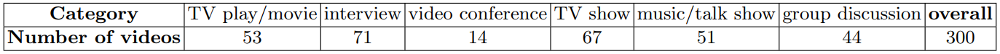

# MVVA-Database
This repository provides the MVVA database in our ECCV paper "[Learning to Predict Salient Faces: A Novel Visual-Audio Saliency Model](https://www.ecva.net/papers/eccv_2020/papers_ECCV/papers/123650409.pdf)" and Pre-print paper "[Joint Learning of Visual-Audio Saliency Prediction and Sound Source Localization on Multi-face Videos](https://arxiv.org/pdf/2111.08567.pdf)". [[code](https://github.com/MinglangQiao/visual_audio_saliency)]

MVVA is a large-scale eye-tracking database of multiple-face video in visual-audio condition. MVVA contains **Eye Movement** data of **34** subjects on **300** videos, as well as the **talking face annotation** in frame level for all 300 videos. 


### Example - fixation annotation
  |    |  
:-------------------------:|:-------------------------:|:-------------------------:
  |    |  

### Example - talking face annotation
  |    |  
:-------------------------:|:-------------------------:|:-------------------------:
  |    |  

<!-- ### comparation with [MUVFET](https://github.com/yufanLIU/salient-face-in-MUVFET)(visual-only) -->


This database can be used for visual-audio saliency prediction, sound source localization, activate speaker detection, speaker diarization, etc. For more details, please refer to [our paper](https://www.ecva.net/papers/eccv_2020/papers_ECCV/papers/123650409.pdf).

## Details
The multiple-face videos in our MVVA database are at diverse scenarios, and can be categorized into 6 classes,
including TV play/movie, interview, video conference, variety show, music and
group discussion. 
<!--  -->
|  <b>Category  | TV play/movie  | interview | video conference | TV show | music/talk show | group overall | overall |
|  :----:  | :----:  | :----:  | :----: |  :----:  | :----:  |  :----:  | :----:  |
| <b>Number of videos | 53 |  71  | 14 | 67 | 51 | 44 | 300 |

The audio content covers different scenarios including quiet scenes and noisy scenes, as reported in the following table. In the noisy scenes, the
background sounds contain laughter, street, music, applause, crowd and noise.
<!--  -->
|  <b>Category  | laughter  | street | music | applause | crowd | noise | quiet scenes | overall |
|  :----:  | :----:  | :----:  | :----: |  :----:  | :----:  |  :----:  | :----:  | :----:  |
| <b>Number of videos | 34 |  17  | 72 | 16 | 46 | 19 | 96 | 300 |

<!-- <p align="center"></p> -->

## Download database
MVVA database can be downloaded from [DropBox (Click to view)](https://www.dropbox.com/s/xuai3q9dn1awy41/mvva_database_v1.zip?dl=0) or [BiaduPan](https://pan.baidu.com/s/1Co2SDgUmaCjgGefJJlFtNg). Please feel free to [contact us by clicking here](mailto:yufan.liu@ia.ac.cn,MinglangQiao@buaa.edu.cn) so that we can give you access to the database.

Then extract it with:
```
unzip mvva_database_v1.zip
```

Run the following command to visualize saliency maps 
```
python demo.py
```

The audio file, face tracking&talking annotation can be download from [Dropbox](https://www.dropbox.com/s/grl1myvxbmac6dv/mvva_database_part2-face_annotation.zip?dl=0) or [[BiaduPan, key:f3iy](https://pan.baidu.com/s/1-wVpTullcpUwybv4T9qacQ)]. 
We provide the audio file for visualization of annotations, and you can also extract the audio by yourself. 
FFmpeg and imageio are necessary for visualization of annotations:
```
sudo apt install ffmpeg
pip install imageio-ffmpeg
```
Then
```
python extract_audio.py
```
to extact audio.

After that, modify the paths of video/audio/face tracking&talking annotations. 
Then run this script to visulize the face talking annotation
```
python demo_face_talking.py
```
Some examples:
```HTML
<video width="320" height="240" controls>
    <source src=https://t1-1258023642.cos.ap-nanjing.myqcloud.com/hmap/fixation_video/mvva_database_related/91_wt_audio.avi" type="video/avi">
    <!-- <source src="movie1.mp4" type="video/mp4"> -->
</video>
```

## Citation

if you find this database useful for your research, please cite:
```
@article{liu2020visualaudio,
  title={Learning to Predict Salient Faces: A Novel Audio-Visual Saliency Model},
  author={Yufan Liu; Minglang Qiao; Mai Xu; Bing Li; Weiming Hu; Ali Borji},
  booktitle=={Proceedings of the european conference on computer vision (eccv)},
  year={2020}
}
```

## Contact
If you have any question, please contact minglangqiao@buaa.edu.cn (or yufan.liu@ia.ac.cn), or use public issues section of this repository.
